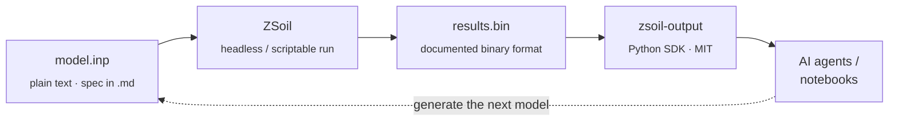

### Built in plain text. Read by machines.

---

Most finite element software locks its models and results inside opaque, proprietary binaries. **ZSoil doesn't.** Every model is a documented text file. Every result is a documented binary with a Python SDK on top. That makes ZSoil one of the few FE platforms an AI agent — or a script, or a colleague six months from now — can actually read, write, and reason about, end to end.

## How the pipeline fits together

No GUI-only state, no undocumented blobs — every stage is a format an AI system, or a human with a text editor, can inspect and generate on its own.

## Why that matters for AI workflows

| | |
|---|---|
| **Plain-text input** | The whole model — geometry, materials, loads, stages — lives in one documented text file. An LLM can read it, explain it, or generate a valid one from a description. |
| **Documented binary output** | Results are stored efficiently, but the layout is specified, not proprietary — any tool can decode it without reverse-engineering. |
| **A Python SDK for every element type** | [`zsoil-output`](https://github.com/ZSoil-FEM/zsoil-output) exposes typed classes for beams, shells, trusses, contacts, membranes, volumic and heat-exchange elements. |
| **Headless & reproducible** | A run is fully reproducible from the input alone — no GUI clicks in the loop — which is what lets an agent generate, run, read, and iterate automatically. |

## Repositories

| Repo | What it's for |
|---|---|
| [`zsoil-output`](https://github.com/ZSoil-FEM/zsoil-output) | Python SDK for reading ZSoil model and result files (formerly ZSoilPy3). MIT licensed. |
| [`zsoil-output-examples`](https://github.com/ZSoil-FEM/zsoil-output-examples) | Ready-to-run scripts for postprocessing ZSoil results with the Python API. |
| [`documentation`](https://github.com/ZSoil-FEM/documentation) | Reference documentation for ZSoil's file formats and I/O. |

---

**ZSoil** — geotechnical & structural FEM software · [www.zsoil.com](https://www.zsoil.com)

